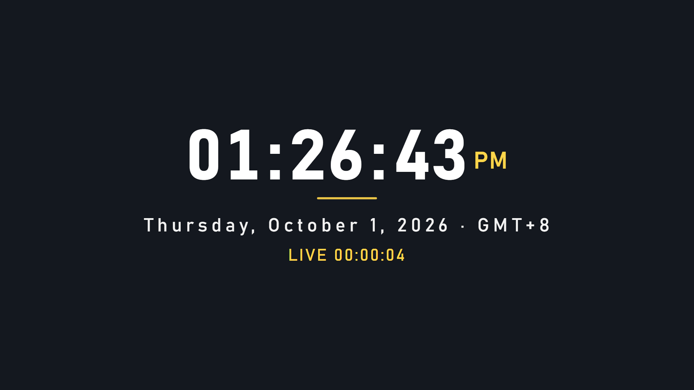
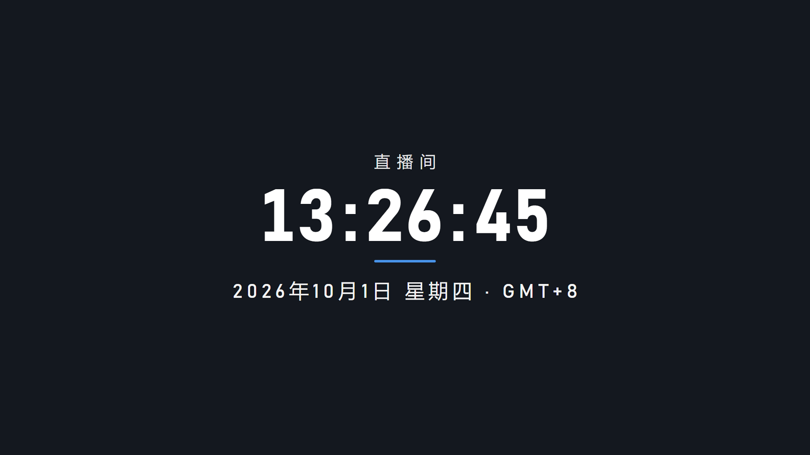

# OBS HTML 时钟（单文件 · 离线可用 · 透明背景 · 多语言/多时区）

## 在线地址（已部署，直接可用）

- **主地址**：<https://tumuyijiao114514.github.io/obs-clock/>
- 带参数示例：<https://tumuyijiao114514.github.io/obs-clock/?lang=en&tzshow=1&timer=1&h24=0>
- 等价路径（明确文件名）：<https://tumuyijiao114514.github.io/obs-clock/obs-clock.html>

部署在 GitHub Pages（仓库 `tumuyijiao114514/obs-clock`，公开）。本机实测**国内直连可用**（无代理 curl 200 + headless Chrome 实拍渲染）；改文件后 `git push`，约 30~60 秒生效。

> 维护注意：根地址能直接用，是因为 `index.html` 是 `obs-clock.html` 的同内容副本 —— 改时钟时记得两份都更新（或重新复制一遍）。
>
> 排除项（均已实测）：jsDelivr 会把用户 HTML 以 `text/plain` 传输（浏览器不渲染），不能拿它当在线地址；catbox / pomf2 等国外文件床国内直连不通。

两种用法，随场景挑：

1. **在线**：OBS 浏览器源里**不勾**「本地文件」，把上面的 URL 粘进「URL」栏
2. **本地**：勾「本地文件」选择 `obs-clock.html`（断网也不白屏，建议留作直播备用源）

默认 = 中文、24 小时制（含秒）、中文日期星期，时区跟随系统。

> 预览图截在深色背景上；实际渲染背景完全透明（已验证背景像素 alpha=0），直接叠加在任意场景。

## 快速使用（OBS Studio）

1. 来源 → `+` → **浏览器**，随便命名
2. 在线：URL 栏粘贴地址（可带参数）；本地：勾选 **本地文件** → 浏览选择 `obs-clock.html`
3. 宽 × 高保持 **1920 × 1080**
4. 确定后在预览里拖动 / 缩放定位

## 语言与时区

- **语言 `lang`**：`zh` `en` `ja` `ko` `vi` `th` `es`，或任意标准语言标签（`en-GB`、`zh-TW`、`pt-BR`…）。日期、星期、上午/下午、计时器前缀都随语言本地化
- **时区 `tz`**：任意 IANA 名称，常用值：
  `Asia/Shanghai`、`Asia/Tokyo`、`Asia/Seoul`、`Asia/Ho_Chi_Minh`、`Asia/Bangkok`、`Europe/London`、`Europe/Paris`、`America/New_York`、`America/Los_Angeles`、`UTC`
- **`tzshow=1`**：在日期后显示时区短名（如 GMT+8 / EDT / JST）

组合示例（在线地址同理，直接在 `?` 后接参数）：

    https://tumuyijiao114514.github.io/obs-clock/?lang=en&tz=America/New_York&h24=0&tzshow=1&timer=1
    https://tumuyijiao114514.github.io/obs-clock/?lang=vi&tz=Asia/Ho_Chi_Minh&tzshow=1

语言或时区填错不会白屏：自动回退（语言回退中文、时区回退本机），已在 Chrome 实测。

## 可调参数

两种方式，随你顺手：

- **URL 参数**：在线地址 / 本地文件路径末尾接 `?...`，多个用 `&` 连接；若环境吃掉 `?` 查询串，改用 `#` 开头（html 顶部注释里有说明）
- **直接编辑**：打开 `obs-clock.html`，改 `<script>` 顶部的 `DEFAULTS`

| 参数 | 默认 | 作用 |
| --- | --- | --- |
| `lang=zh` | zh | 语言：见上，或任意标准标签 |
| `tz=Asia/Shanghai` | 跟随系统 | 时区（IANA 名称） |
| `tzshow=1` | 不显示 | 日期后显示时区短名 |
| `h24=0` | 24 小时制 | 切 12 小时制（上午/下午随语言） |
| `sec=0` | 显示秒 | 隐藏秒 |
| `date=0` | 显示日期 | 隐藏日期行 |
| `bar=0` | 显示点缀线 | 隐藏时间下方短线 |
| `blink=1` | 不闪 | 冒号每秒闪烁 |
| `size=18` | 16 | 整体字号（1080p 用 14~20，720p 用 10~14） |
| `color=ffd54a` | 白色 | 文字颜色（6 位十六进制，不带 #） |
| `accent=ff7ab6` | 蓝色 | 点缀色：上午/下午、点缀线、计时器 |
| `label=今晚八点开播` | 无 | 顶部小字 |
| `timer=1` | 关 | 显示「已直播 00:00:00」，自加载起计时（刷新归零） |
| `timerlabel=LIVE` | 按语言 | 计时器前缀文字（中文默认「已直播」、英语「LIVE」、日语「配信中」…） |
| `datefmt=iso` | 按语言 | 日期改成 `2026-10-01 Thursday` |

## 换字体

把 `.ttf`/`.otf` 放同目录 → 打开 html 顶部注释里的 `<style>` 示例 → 取消注释、改成实际文件名（在线版需连同字体文件一起 push）。用本地字体文件，别挂在线字体（断网/代理抖动会掉字）。

## 已验证项（本机实测）

- **在线地址**：无代理直连 curl 200（`text/html; charset=utf-8`）；headless Chrome 无代理实拍英语版（AM/PM、EDT/GMT+8、LIVE 计时、金色主题）与中文版（直播间小字、GMT+8）均正确渲染，URL 参数在线生效
- 默认中文样式、12 小时制、顶部小字、计时器渲染正常
- 语言实测：`en`（Thursday, October 1, 2026 · EDT）、`ja`（2026年10月1日木曜日 · JST，无缺字）、`vi`（Thứ Năm, 1 tháng 10, 2026 · GMT+7，声调符号完整）
- 时区换算正确：纽约 01:17 上午、东京 午后 02:17、胡志明市 12:17（相对本机北京时间 13:17）
- 容错：语言/时区填错自动回退，不白屏
- 背景透明：截图背景像素 alpha=0
- 等宽数字（tabular-nums），整点跳字不抖动
- 直连可达性实测（2026-10-01）：github.io ✓、cdn.jsdelivr.net ✓（但 HTML 返回 text/plain，弃用）、catbox ✗、pomf2 ✗

## 其他现成在线方案（2026-10-01 检索 + 可达性实测）

**他人部署的在线时钟（OBS 直接可用，国内直连可达；功能性未逐一深测）**：

- <https://detekoi.github.io/minimal-clock-overlay/>（BSD-2，极简）
- <https://sekalipakaibuang.github.io/obs-clock-overlay/>（MIT）
- <https://clock.seanut.app>（自定义域名托管版）
- <https://obs-clock-widget.pages.dev/>（Cloudflare Pages 版，可远程配置）

**商业在线工具（可达性已测，功能与参数支持未深测）**：
benrilab.com（Stream Clock）、textoolbox.com（OBS Clock Overlay）、timerhub.io、jamluca.com（1600+ 字体）、analogueclock.com（有中文页）、clocklink.com（老牌 HTML5 嵌入时钟生成器，可选时区）、vclock.com（带 embed 功能）；oneflipclock.com 国内直连不通。

## 小坑

- OBS 浏览器源有页面缓存：改了文件 / 更新了在线版没生效，就在源属性里点「刷新缓存」。
- 在线版走网络：直播时若网络抖动，页面已在 OBS 缓存中仍可显示；但首次加载和刷新需要能访问 github.io（本机实测直连可用；不行时开着 Clash 即可）。
- 本地文件版不联网 —— 断网/代理抖动都不会白屏，作为备用源最稳。
