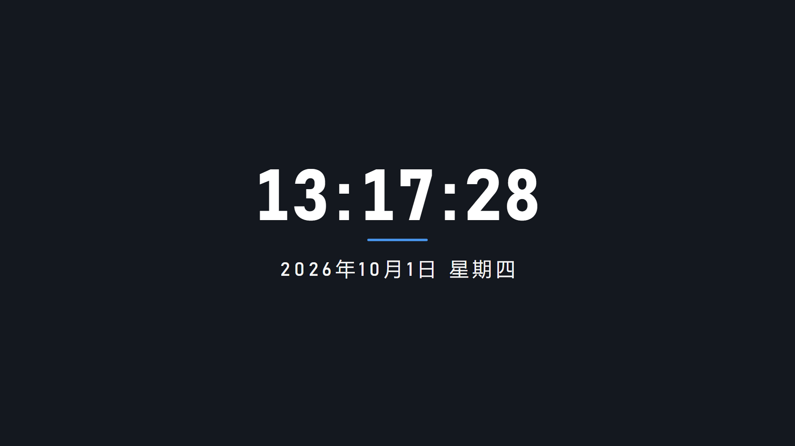
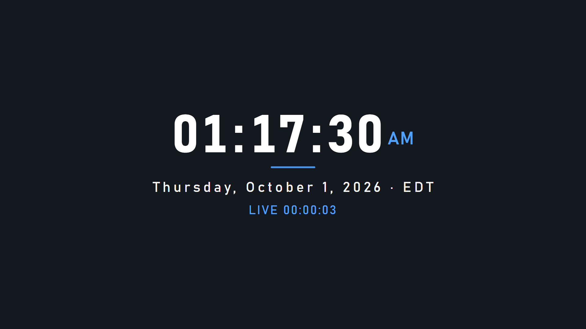
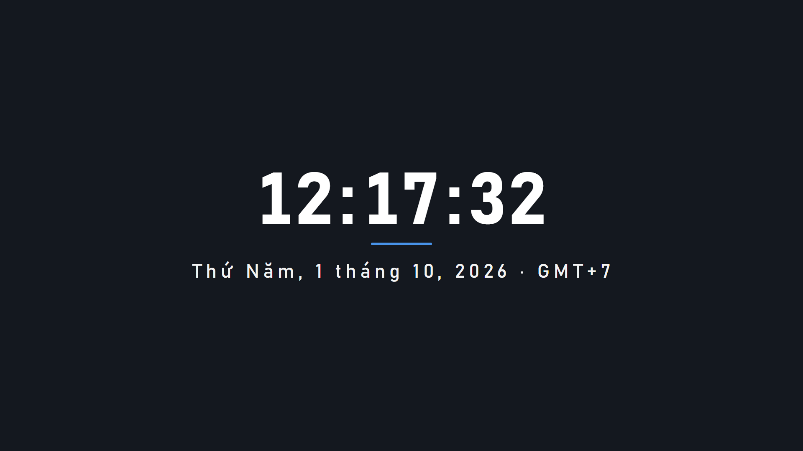

# OBS HTML 时钟（单文件 · 离线 · 透明背景 · 多语言/多时区）

给 OBS「浏览器源」用的时钟：零依赖、纯本地文件，断网也不会白屏。默认 = 中文、24 小时制（含秒）、中文日期星期，时区跟随系统。

> 预览图截在深色背景上；实际渲染背景完全透明（已验证背景像素 alpha=0），直接叠加在任意场景。

## 快速使用（OBS Studio）

1. 来源 → `+` → **浏览器**，随便命名
2. 勾选 **本地文件** → 浏览选择 `obs-clock.html`
3. 宽 × 高保持 **1920 × 1080**
4. 确定后在预览里拖动 / 缩放定位

## 语言与时区

- **语言 `lang`**：`zh` `en` `ja` `ko` `vi` `th` `es`，或任意标准语言标签（`en-GB`、`zh-TW`、`pt-BR`…）。日期、星期、上午/下午、计时器前缀都随语言本地化
- **时区 `tz`**：任意 IANA 名称，常用值：
  `Asia/Shanghai`、`Asia/Tokyo`、`Asia/Seoul`、`Asia/Ho_Chi_Minh`、`Asia/Bangkok`、`Europe/London`、`Europe/Paris`、`America/New_York`、`America/Los_Angeles`、`UTC`
- **`tzshow=1`**：在日期后显示时区短名（如 GMT+8 / EDT / JST）

组合示例：

    ?lang=en&tz=America/New_York&h24=0&tzshow=1&timer=1
    ?lang=vi&tz=Asia/Ho_Chi_Minh&tzshow=1

语言或时区填错不会白屏：自动回退（语言回退中文、时区回退本机），已在 Chrome 实测。

## 可调参数

两种方式，随你顺手：

- **URL 参数**：接在浏览器源路径/URL 末尾（`?...`，多个用 `&` 连接）；若环境吃掉 `?` 查询串，改用 `#` 开头（html 顶部注释里有说明）
- **直接编辑**：打开 `obs-clock.html`，改 `<script>` 顶部的 `DEFAULTS`

| 参数 | 默认 | 作用 |
| --- | --- | --- |
| `lang=zh` | zh | 语言：见上，或任意标准标签 |
| `tz=Asia/Shanghai` | 跟随系统 | 时区（IANA 名称） |
| `tzshow=1` | 不显示 | 日期后显示时区短名 |
| `h24=0` | 24 小时制 | 切 12 小时制（上午/下午随语言） |
| `sec=0` | 显示秒 | 隐藏秒 |
| `date=0` | 显示日期 | 隐藏日期行 |
| `bar=0` | 显示点缀线 | 隐藏时间下方短线 |
| `blink=1` | 不闪 | 冒号每秒闪烁 |
| `size=18` | 16 | 整体字号（1080p 用 14~20，720p 用 10~14） |
| `color=ffd54a` | 白色 | 文字颜色（6 位十六进制，不带 #） |
| `accent=ff7ab6` | 蓝色 | 点缀色：上午/下午、点缀线、计时器 |
| `label=今晚八点开播` | 无 | 顶部小字 |
| `timer=1` | 关 | 显示「已直播 00:00:00」，自加载起计时（刷新归零） |
| `timerlabel=LIVE` | 按语言 | 计时器前缀文字（中文默认「已直播」、英语「LIVE」、日语「配信中」…） |
| `datefmt=iso` | 按语言 | 日期改成 `2026-10-01 Thursday` |

## 换字体

把 `.ttf`/`.otf` 放本目录 → 打开 html 顶部注释里的 `<style>` 示例 → 取消注释、改成实际文件名。用本地字体文件，别挂在线字体（断网/代理抖动会掉字）。

## 已验证项（本机 headless Chrome 实测）

- 默认中文样式、12 小时制、顶部小字、计时器均渲染正常（见预览图）
- 语言实测：`en`（Thursday, October 1, 2026 · EDT）、`ja`（2026年10月1日木曜日 · JST，无缺字）、`vi`（Thứ Năm, 1 tháng 10, 2026 · GMT+7，声调符号完整）
- 时区换算正确：纽约 01:17 上午、东京 午后 02:17、胡志明市 12:17（相对本机北京时间 13:17）
- 容错：语言/时区填错自动回退，不白屏
- 背景透明：截图背景像素 alpha=0
- 等宽数字（tabular-nums），整点跳字不抖动

## 其他现成开源方案（2026-10 检索 GitHub 所得）

| 项目 | 许可 | 特点 | 备注 |
| --- | --- | --- | --- |
| [grovixlab/kyoto](https://github.com/grovixlab/kyoto) | MIT | 可视化配置面板 + 实时预览，多文件 | 1 星，较新 |
| [gameszense/obs-clock-widget](https://github.com/gameszense/obs-clock-widget) | GPL-3.0 | 单文件，可调字体/描边/透明度 | 1 星，较新 |
| [somali0128/clock-widget-qiu](https://github.com/somali0128/clock-widget-qiu) | 未标注 | 中文，可爱风素材可替换 | 未标许可，商用注意 |

以上三个仅做了 README / 仓库结构层面的核对，没实机跑过 OBS；本目录的 `obs-clock.html` 是实际渲染验证过的版本。

## 小坑

- OBS 浏览器源有页面缓存：改了文件没生效，就在源属性里点「刷新缓存」。
- 本文件完全不联网 —— 断网/代理抖动都不会白屏，这是用本地文件而非在线挂件的意义。
